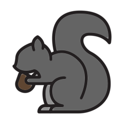

# Demos
## Browser-based visualizations:
  * diffusion on a 1D lattice.

## Setup, build, and run

Install parcel and svelte packages and start a development webserver:
```
npm install
npm run start
```

Then open in a browser:
```
open http://localhost:1234
```



## Credits
* Icons: [Selman Design](https://selman.nyc/)
